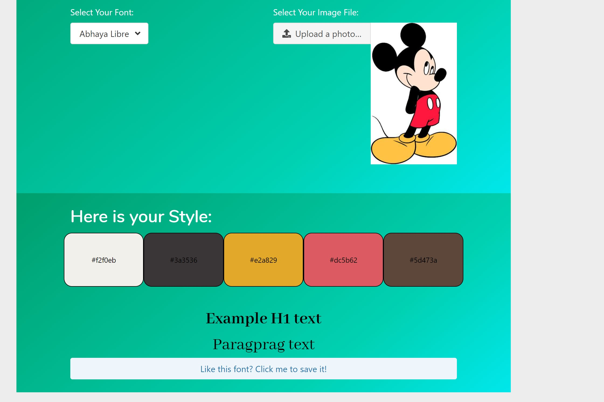

# Catch-Source-Style:  A web tool for new web developers and designers
# Description:
A color and font selection tool for web designers and developers.

# Background
Being new to web design and developing is a steep learning curve. Having so much to focus on in the first few weeks of your web developer journey is dauting so we wanted to come up with a tool that we would of found useful at the start of our journey and so Catch - Source - Style was developed

# Features
Try out over 1000 fonts with our responsive font selector and see exactly how it will look immediately on the webpage
Upload an image and see the dominant primary colours from the image that you can choose to use
Copy the font style and the colour hexidecimal code to use immediately in your web design work.
Save your style choices to come back to later.

# Usage

The image above shows the usage of the two apis. The exmaple text is shown in the font chosen by the user and the primary colours can be seen above.

The web app is free to use for all web designers and developers. We ask that you acknowledge us in your meta data information as a courtesy.
We welcome any inputs and suggestions to develop the code further, but please do not modifiy the original code.

# Future Developments
Current future developments for the web app include an automatically generation of a simple webpage set up utilizing the colour and font choices of the user.
Generate a pdf output to be used in presentations and to share collaboratively.

# Authors
Back-end coding and development: Michelle Hall, Ben Cyna, Donald Wu
Front-end design and development: Bella Santiago

# License
https://opensource.org/licenses/GPL-3.0

